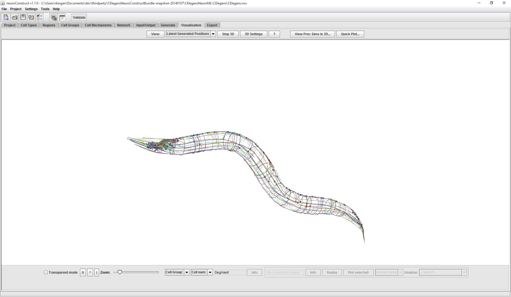
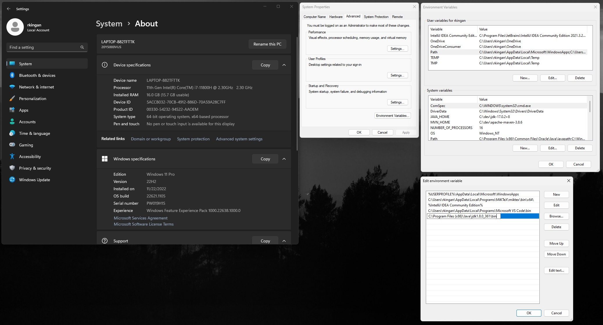
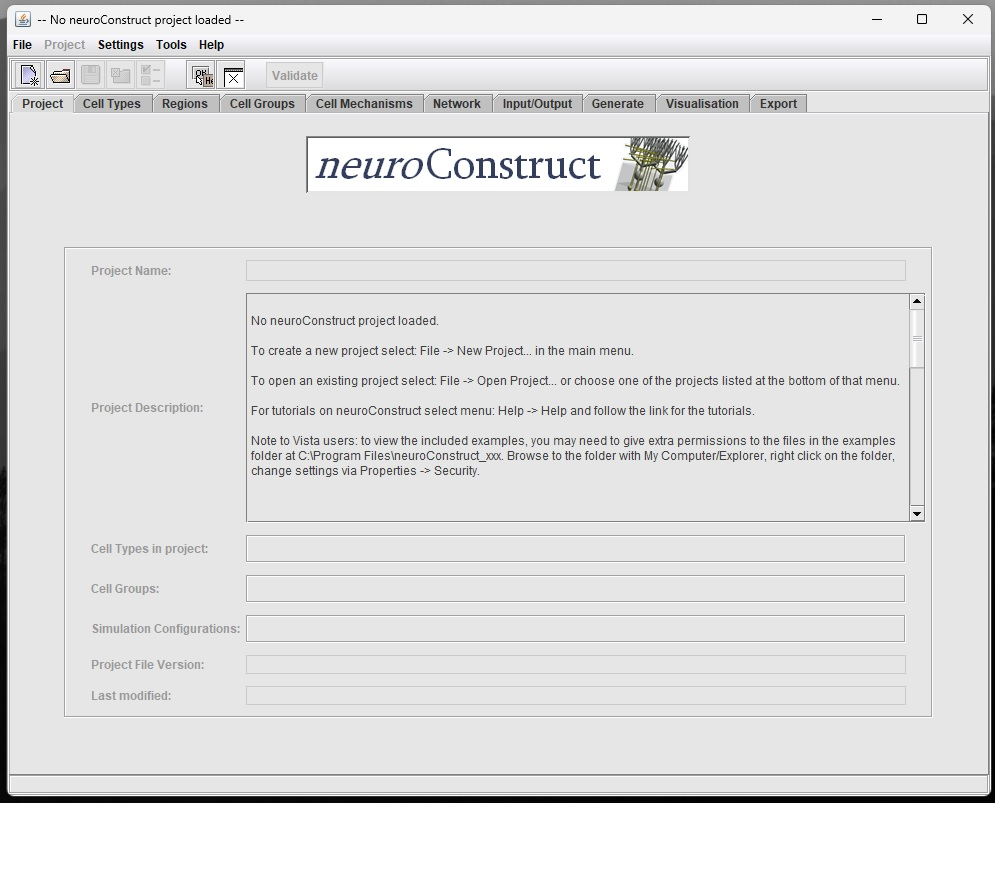
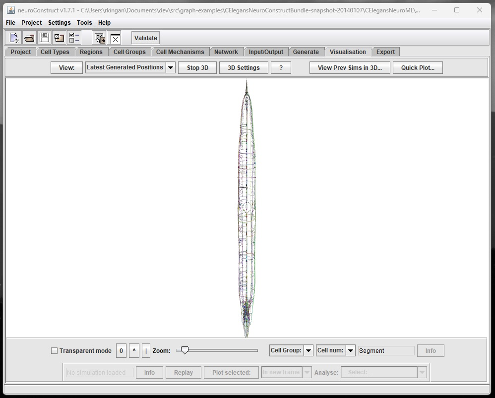

Making the cover diagram
========================



The cover diagram, a representation of the connectome of *C Elegans*, was
generated using a software system called
[neuroConstruct](https://github.com/NeuralEnsemble/neuroConstruct) using a data
file from the [CElegansNeuroML](https://github.com/openworm/CElegansNeuroML)
collection. The process of setting up and running the software can be somewhat
complicated. I've included a list of the steps I followed to run the software on
my Windows notebook computer.

## Prerequisites - an older version of Java

To get the program to compile and run correctly, I needed to use an older
version of the Java Development Kit (JDK); specifically, version 8. It can be
found on the [Oracle website,
here](https://www.oracle.com/java/technologies/downloads/#java8-windows). You
will want to download the version called "x86 Installer", and you will need a
(free) Oracle account in order to download it. Once you download and install it,
you will need to make sure that the directory containing executable programs for
the JDK is on your PATH. You can do this via a command in the Command Prompt program:

```
set PATH="C:\Program Files (x86)\Java\jdk1.8.0_361\bin";%PATH%
```

or you can go into your Windows settings and make the change there: 

1. Access Settings from the Start menu.
2. Select System
3. Select About
4. Click the link labeled "Advanced system settings"
5. Click the button labeled "Environment Variables..."
6. Under "User variables for [your user name]" select Path and click the "Edit..." button.
7. Use the "New" button to add C:\Program Files (x86)\Java\jdk1.8.0_361\bin to the list of directories.
8. Press "Ok" on the "Edit environment variable window", the "Environment Variables" window and the "System Properties" window.



## Getting a copy of the software

The link above to neuroConstruct goes to a GitHub repository. You can follow
[these
instructions](https://docs.github.com/en/desktop/contributing-and-collaborating-using-github-desktop/adding-and-cloning-repositories/cloning-and-forking-repositories-from-github-desktop)
to make a local copy. You should put the local copy in the root directory of
your C: drive (so it will be at C:\neuroConstruct) so that you can avoid making
edits to any of the scripts.

## Building the software

Open a Command Prompt window and navigate to the directory with the software:

```
C:
cd \neuroConstruct
```

Then run the following command to build the system:

```
.\nC.bat -make
```

If everything works correctly you should now have a file in the current
directory called `neuroConstruct_1.7.4.jar` (the version number may change over
time).

## Getting the *c Elegans* data file

Follow the same procedure outlined above to get a local copy of the CElegansNeuroML repository. 

## Running the software and generating the visualization

Run, or return to, the Command Prompt and navigate to the C:\neuroConstruct
directory. To run the program enter this:

```
.\nC.bat
```

(This is the same as above but without `-make`.) The program should run and a window like this should appear:



Now you can load the *C Elegans* data! It will be located in your copy of the CElegansNeuroML repository in a subdirectory called "CElegans". The name of the file is "CElegans.ncx". In the neuroConstruct program, select teh File menu and then "Open Project...". Then navigate to the data file and open it. It will take a few seconds to load, and then the application will display some summary information.

## Generate the visualization

Go to the tab labeled "Generate" in neuroConstruct and click the button labeled "Generate Cell Positions and Connections". A progress bar will appear while the generation process executes, and when it is done it will display "Network generated".

Finally, go to the tab labeled "Visualisation" and click the button labeled "View:"



You can now use the mouse to rotate and zoom.
